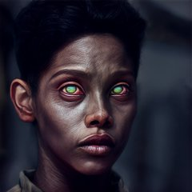

# Structured Dreaming
###### Note that this is a work in progress and will change or it might freeze in time in an unfinished state.

## Colabs
  
[Styledreams](https://colab.research.google.com/github/ekgren/StructuredDreaming/blob/main/colabs/Structured_Dreaming_Styledreams.ipynb)
-- CLIP x Stylegan2 notebook

## Optimizer
In this repo The ClampSGD optimizer is used it also has it's own repository here: [https://github.com/ekgren/open-optimizers](https://github.com/ekgren/open-optimizers).

## Introduction
By now it is well known that neural networks trained to classify images also have the capacity to generate
images [[1]](#1). There are a lot of variations on
this theme with entire artistic movements based on DeepDream [[4]](#4), libraries such as Lucid [[6]](#6) 
and advanced feature visualization tools such as OpenAI microscope [[7]](#7). With the release of
CLIP [[5]](#5) and open research on twitter [[8]](#8) generative exploration of image networks has gained a lot of popularity.

As described in Differentiable image parameterizations [[1]](#1) all these
generative techniques work in the same way. Given a network used for image related tasks such
as representational learning or classification we can backpropagate from a desired representation
and optimize the input image towards a high activation image. 

The simplest parametrization of the input image is in the form of RGB values for each pixel. 
But naively backpropagating to the image will not work as described in the chapter 
[Enemy of feature visualization](https://distill.pub/2017/feature-visualization/#enemy-of-feature-vis) of Feature Visualization [[2]](#2). 
The network ends up “cheating” and you will end up with an image full of noise and 
nonsensical high-frequency patterns that the network responds strongly to.  

In this work we will continue to explore different techniques to avoid the "cheating" and create both informative and
or visually interesting images.

## References
<a id="1">[1]</a> 
Mordvintsev, A., Pezzotti, N., Schubert, L., & Olah, C. (2018).  
Differentiable image parameterizations. Distill, 3(7), e12.  
https://distill.pub/2018/differentiable-parameterizations/  

<a id="2">[2]</a> 
Olah, C., Mordvintsev, A., & Schubert, L. (2017).   
Feature visualization. Distill, 2(11), e7.  
https://distill.pub/2017/feature-visualization/ 

<a id="3">[3]</a>
Goh, G., Cammarata, N., Voss, C., Carter, S., Petrov, M., Schubert, L., ... & Olah, C. (2021).  
Multimodal neurons in artificial neural networks. Distill, 6(3), e30.

<a id="4">[4]</a>
https://ai.googleblog.com/2015/06/inceptionism-going-deeper-into-neural.html

<a id="5">[5]</a>
https://github.com/openai/CLIP

<a id="6">[6]</a>
https://github.com/tensorflow/lucid

<a id="7">[7]</a>
https://microscope.openai.com/

<a id="8">[8]</a>
https://twitter.com/advadnoun/status/1348375026697834496
